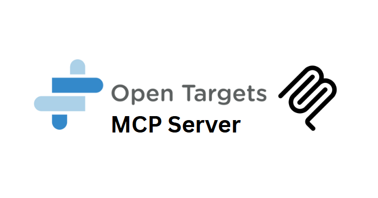

# Unofficial Open Targets MCP Server 🧬

Unofficial Model Context Protocol server for accessing Open Targets platform data for gene-drug-disease associations research.

[](https://platform.opentargets.org/) 

Developed by [Augmented Nature](https://augmentednature.ai) 

## ✅ **Verified Features**

**All 6 tools working with live Open Targets API data:**

- 🎯 **Target Search** - Gene symbols, names, descriptions (BRCA1, TP53, etc.)
- 🦠 **Disease Search** - Names, synonyms, descriptions (cancer, diabetes, etc.)
- 🔗 **Target-Disease Associations** - Evidence scores from 20+ databases
- 📊 **Disease Target Summaries** - Prioritized therapeutic targets
- 🧬 **Target Details** - Comprehensive gene/protein information
- 🎭 **Disease Details** - Complete disease profiles with ontologies

## 🚀 **Quick Start**

```bash
# Install and build
npm install
npm run build

# Run the server
node build/index.js
```

## 📋 **MCP Client Configuration**

### Claude Desktop

```json
{
  "mcpServers": {
    "opentargets-server": {
      "command": "node",
      "args": ["/path/to/opentargets-server/build/index.js"]
    }
  }
}
```

### Other MCP Clients

```bash
node /path/to/opentargets-server/build/index.js
```

## 🛠️ **Available Tools**

### 🎯 `search_targets`

**Search therapeutic targets by gene symbol, name, or description**

```json
{
  "name": "search_targets",
  "arguments": {
    "query": "BRCA1", // Gene symbol, name, or description
    "size": 10 // Optional: 1-500 results (default: 25)
  }
}
```

**Example Results:**

- **BRCA1** (ENSG00000012048) - BRCA1 DNA repair associated
- **BRCA2** (ENSG00000139618) - BRCA2 DNA repair associated
- **BRIP1** (ENSG00000136492) - BRCA1 interacting DNA helicase 1

### 🦠 `search_diseases`

**Search diseases by name, synonym, or description**

```json
{
  "name": "search_diseases",
  "arguments": {
    "query": "breast cancer", // Disease name, synonym, or description
    "size": 10 // Optional: 1-500 results (default: 25)
  }
}
```

### 🔗 `get_target_disease_associations`

**Get target-disease associations with evidence scores**

```json
{
  "name": "get_target_disease_associations",
  "arguments": {
    "targetId": "ENSG00000012048", // Target Ensembl ID
    "size": 10 // Optional: 1-500 results
  }
}
```

**OR**

```json
{
  "name": "get_target_disease_associations",
  "arguments": {
    "diseaseId": "EFO_0000305", // Disease EFO ID
    "size": 10 // Optional: 1-500 results
  }
}
```

### 📊 `get_disease_targets_summary`

**Get prioritized targets associated with a disease**

```json
{
  "name": "get_disease_targets_summary",
  "arguments": {
    "diseaseId": "EFO_0000305", // Disease EFO ID (required)
    "size": 20 // Optional: 1-500 targets (default: 50)
  }
}
```

### 🧬 `get_target_details`

**Get comprehensive target information**

```json
{
  "name": "get_target_details",
  "arguments": {
    "id": "ENSG00000012048" // Target Ensembl gene ID
  }
}
```

### 🎭 `get_disease_details`

**Get comprehensive disease information**

```json
{
  "name": "get_disease_details",
  "arguments": {
    "id": "EFO_0000305" // Disease EFO ID
  }
}
```

## 📚 **Resource Templates**

Access Open Targets data through standardized URIs:

- `opentargets://target/{ensemblId}` - Complete target information
- `opentargets://disease/{efoId}` - Complete disease information
- `opentargets://drug/{chemblId}` - Drug information
- `opentargets://association/{targetId}/{diseaseId}` - Association evidence
- `opentargets://search/{query}` - Search results

## 🧪 **Real-World Examples**

### Cancer Research Workflow

```bash
# 1. Search for cancer-related targets
{"name": "search_targets", "arguments": {"query": "oncogene", "size": 10}}

# 2. Get detailed info for specific target
{"name": "get_target_details", "arguments": {"id": "ENSG00000012048"}}

# 3. Find all diseases associated with BRCA1
{"name": "get_target_disease_associations", "arguments": {"targetId": "ENSG00000012048"}}

# 4. Get top targets for breast cancer
{"name": "get_disease_targets_summary", "arguments": {"diseaseId": "EFO_0000305", "size": 20}}
```

### Drug Discovery Pipeline

```bash
# 1. Search for Alzheimer's disease
{"name": "search_diseases", "arguments": {"query": "Alzheimer", "size": 5}}

# 2. Get disease details
{"name": "get_disease_details", "arguments": {"id": "EFO_0000249"}}

# 3. Find prioritized therapeutic targets
{"name": "get_disease_targets_summary", "arguments": {"diseaseId": "EFO_0000249", "size": 30}}
```

## 🔬 **Data Sources & Standards**

**Open Targets integrates 20+ databases:**

- **ChEMBL** - Drug & compound data
- **Ensembl** - Gene & protein annotations
- **EFO** - Experimental Factor Ontology
- **ClinVar** - Clinical variant data
- **GWAS Catalog** - Genome-wide association studies
- **UniProt** - Protein sequences & functions
- **Reactome** - Biological pathways
- **And many more...**

**Standardized Identifiers:**

- **Targets**: Ensembl gene IDs (e.g., ENSG00000012048)
- **Diseases**: EFO IDs (e.g., EFO_0000305)
- **Drugs**: ChEMBL IDs (e.g., CHEMBL1234)

## 🏗️ **Architecture**

- **TypeScript** implementation with robust type safety
- **GraphQL** queries for efficient data retrieval
- **MCP Protocol** compliant JSON-RPC communication
- **Error Handling** with comprehensive validation
- **Production Ready** with 30s timeouts and proper logging

## 📊 **API Information**

- **Base URL**: `https://api.platform.opentargets.org/api/v4/graphql`
- **Version**: Open Targets v25.0.1
- **Rate Limits**: Generous for research use
- **Authentication**: None required
- **Format**: GraphQL queries, JSON responses

## 🤝 **Contributing**

This server is developed and maintained by [Augmented Nature](https://augmentednature.ai). For enhancements:

1. Fork the repository
2. Make your changes
3. Submit a pull request

## **Support**

For issues with:

- **MCP Server**: Check the server logs and error outputs
- **Open Targets API**: Visit [platform.opentargets.org](https://platform.opentargets.org/)
- **GraphQL Queries**: Use the [Open Targets GraphQL browser](https://api.platform.opentargets.org/api/v4/graphql/browser)

## Citation
If you use this project in your research or publications, please cite it as follows:

```bibtex @misc{opentargetsmcp2025, 
author = {Moudather Chelbi},
title = {OpenTargets MCP Server},
year = {2025},
howpublished = {https://github.com/Augmented-Nature/OpenTargets-MCP-Server},
note = {Accessed: 2025-06-29}
